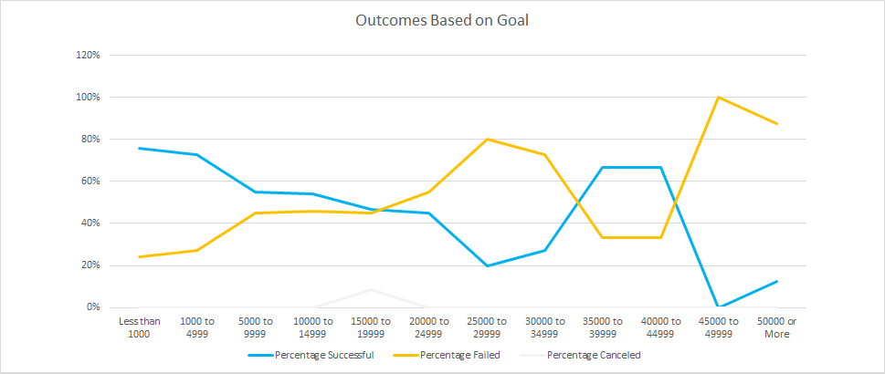

# Kickstarting with Excel

## Overview of Project

### Purpose
  The purpose of this project is to identify how campaigns, more specifically theater and plays, did in relation to their launch dates and fundraising goals. 

## Analysis and Challenges

### Analysis of Outcomes Based on Launch Date
Method Used: Pivot Table
Criteria: 
  Columns: Outcomes
  Values: Count of Outcomes
  Rows: Date Created Conversion
  Filters: Years, Parent Category

### Analysis of Outcomes Based on Goals
Method Used: Countifs, Sum, Average, Line Graph

Example: =COUNTIFS(Kickstarter!$D:$D,"<1000",Kickstarter!$F:$F,"successful",Kickstarter!$V:$V,"plays")

### Challenges and Difficulties Encountered
Because of the ammount of countifs requiered to complete the *Outcomes Based on Goal*, I chose to complete only the "number successful" calculations. From there I locked the columns I needed to in the formula and then drug them over to failed and cancel columns and used ctrl H to find and replace "successful" with "failed" and "canceled"

## Results

- What are two conclusions you can draw about the Outcomes based on Launch Date?
  
  1. October is the worst month to launch campaign because it has the most fails.
  2. The second quarter produces the most successful launced campaigns. In the future look to lauch a campaign in April, May, and June. May being best case scenario because it had the most succesful launched campaigns

- What can you conclude about the Outcomes based on Goals?
  1. If you need need between $30,000 and $34,999 ask for $35,000 - $39,999 because $30-$34,999 has the 2nd least amount of succesful campaigns at 27% and the 2nd highest fail rate of 73% while the $35-$39,999 group saw a 67% success rate and only a 33% fail rate. However, If one doesnt need to raise that much money run a campaign for $4,999 or less becasue those two categories had the highest success rates at 76% and 73%.

- What are some limitations of this dataset?
  1. You cant compare any of this to how louise's play *Fever* did in the same timeframe.
  
- What are some other possible tables and/or graphs that we could create?
  1. Could have a reference point on the Launch date chart showing where *Fever* launched
  2. Analysis on percent to goal for all failed and successful campaigns to look at the margins for trends.
